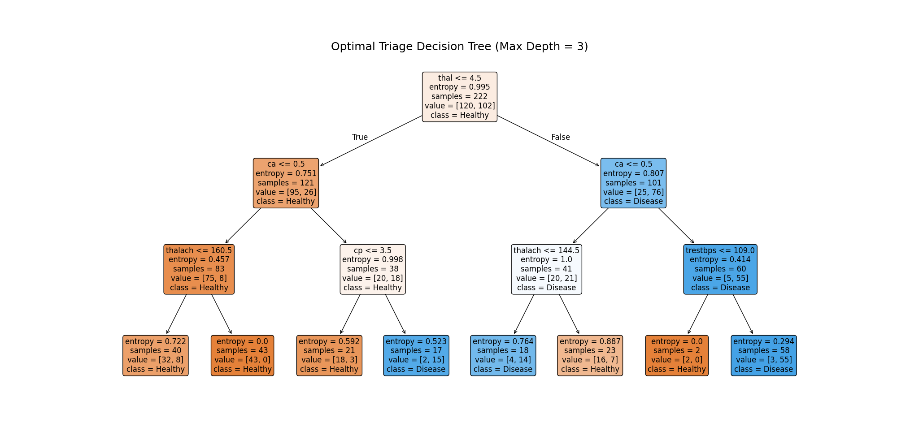
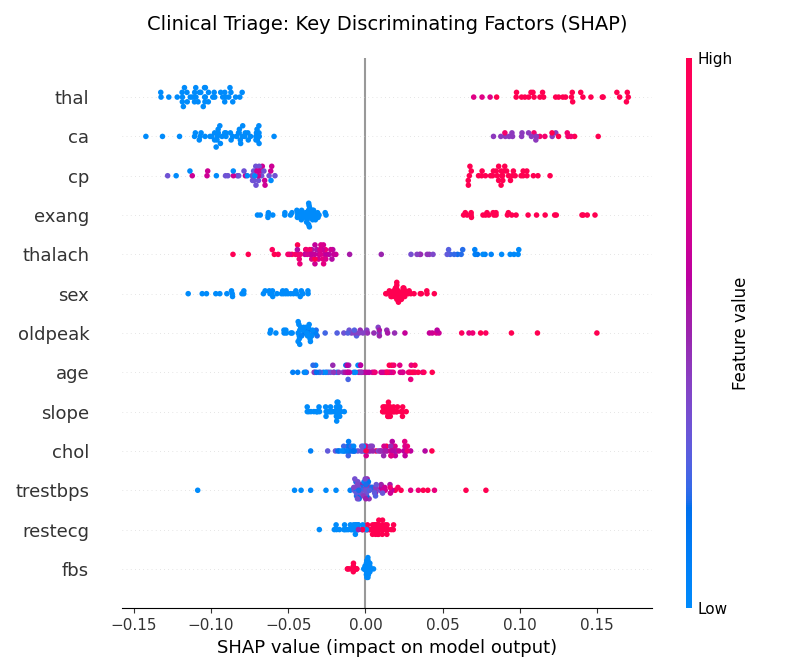

# Cardio-Economics: Clinical Triage Optimization Report

## 1. Executive Financial Summary
By implementing a Cascading Machine Learning pipeline, the system achieved an accuracy of **77.3%** while reducing unnecessary tests.
- **Total Hospital Savings:** $191,750.00 (approx. 80% reduction)

## 2. Statistical Performance by Tier (DeLong Validated)
The following table demonstrates the marginal diagnostic utility of each clinical step. Notice the plateau at Tier 3 (Blood Labs).

| Tier                |   AUC |   95% CI Lower |   95% CI Upper |
|:--------------------|------:|---------------:|---------------:|
| Tier 1: Baseline    | 0.799 |          0.692 |          0.891 |
| Tier 2: Vitals      | 0.78  |          0.67  |          0.878 |
| Tier 3: Blood Lab   | 0.81  |          0.703 |          0.902 |
| Tier 4: Stress Test | 0.858 |          0.766 |          0.936 |
| Tier 5: Specialized | 0.889 |          0.81  |          0.955 |

## 3. The Optimal Clinical Path (Decision Tree)
The algorithm extracted the following flowchart to maximize diagnostic gain per dollar spent. Note the absence of cholesterol testing.

```text
|--- thal <= 4.50
|   |--- ca <= 0.50
|   |   |--- thalach <= 160.50
|   |   |   |--- class: 0
|   |   |--- thalach >  160.50
|   |   |   |--- class: 0
|   |--- ca >  0.50
|   |   |--- cp <= 3.50
|   |   |   |--- class: 0
|   |   |--- cp >  3.50
|   |   |   |--- class: 1
|--- thal >  4.50
|   |--- ca <= 0.50
|   |   |--- thalach <= 144.50
|   |   |   |--- class: 1
|   |   |--- thalach >  144.50
|   |   |   |--- class: 0
|   |--- ca >  0.50
|   |   |--- trestbps <= 109.00
|   |   |   |--- class: 0
|   |   |--- trestbps >  109.00
|   |   |   |--- class: 1

```



## 4. Key Discriminating Factors (SHAP)
The factors driving the decision tree logic, highlighting Chest Pain Type and Thallium imaging as the primary drivers of clinical certainty.



## 5. ROC Curve Comparisons
Visual representation of the diagnostic lift across tiers.

*(Note: Interactive ROC curve saved as roc_curves.html)*

